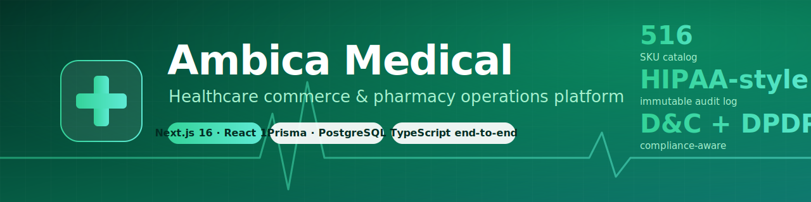
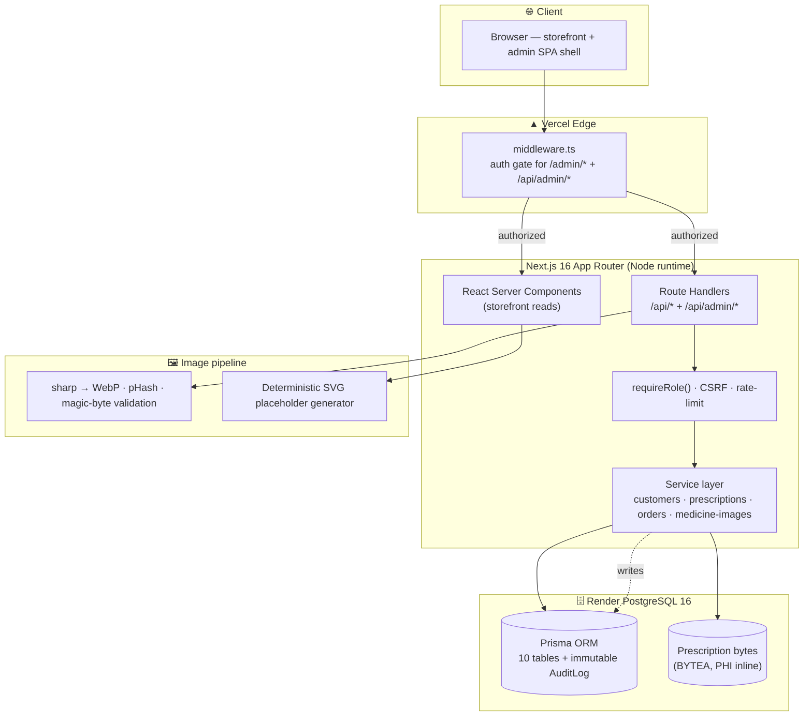
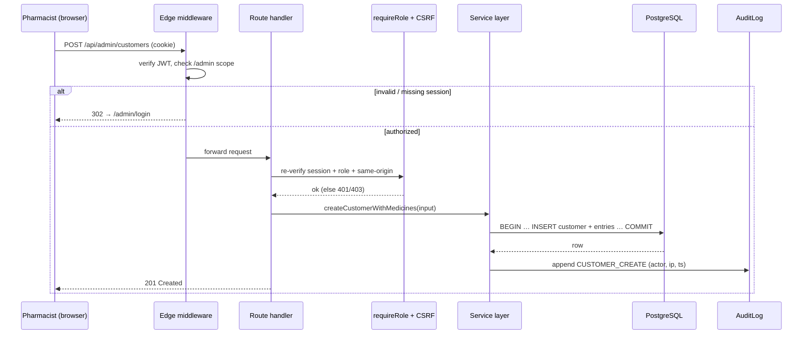
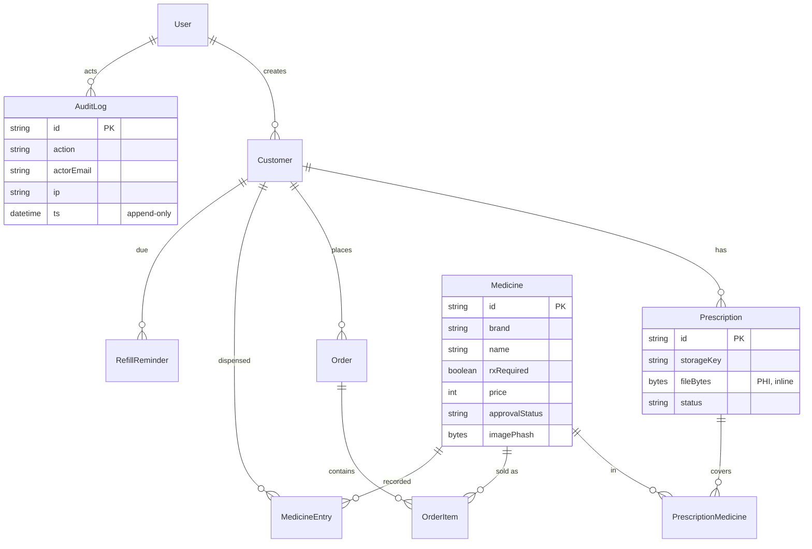

<div align="center">



<br/>

<h3>Healthcare, reimagined — a licensed online pharmacy + dispensary CRM, built like a product.</h3>

<p>
A full-stack healthcare-commerce platform: a customer-facing medicine storefront and a staff-only
pharmacy operations back office, engineered with production-grade security, an immutable PHI audit
trail, and an original image pipeline — end-to-end TypeScript on Next.js 16.
</p>

<!-- Badges -->
<p>
  
  
  
  
  
  
</p>

<p>
  <a href="https://ambica-medical.vercel.app"></a>
  
  
  
  
</p>

<p>
  <a href="https://ambica-medical.vercel.app"><b>Live Demo</b></a> ·
  <a href="#-features"><b>Features</b></a> ·
  <a href="#-architecture"><b>Architecture</b></a> ·
  <a href="./docs/SYSTEM_DESIGN.md"><b>System Design</b></a> ·
  <a href="./docs/API_REFERENCE.md"><b>API</b></a> ·
  <a href="./SECURITY.md"><b>Security</b></a> ·
  <a href="./docs/PERFORMANCE.md"><b>Performance</b></a> ·
  <a href="./CONTRIBUTING.md"><b>Contributing</b></a>
</p>

</div>

---

## 📑 Table of contents

- [Why this exists](#-why-this-exists)
- [Live demo](#-live-demo)
- [Screenshots](#-screenshots)
- [Features](#-features)
- [Architecture](#-architecture)
- [Tech stack](#-tech-stack)
- [Data model](#-data-model)
- [Security](#-security)
- [Performance](#-performance)
- [Getting started](#-getting-started)
- [Deploy your own](#-deploy-your-own)
- [Project structure](#-project-structure)
- [Roadmap](#-roadmap)
- [Contributing](#-contributing)
- [License](#-license)

---

## 💡 Why this exists

India's neighbourhood pharmacies run on paper registers, WhatsApp order screenshots, and memory.
**Ambica Medical** digitises that workflow end-to-end — a real storefront customers can browse and
order from, plus a dispensary CRM the pharmacist actually uses: customer records, prescription
capture, dispensing timelines, refill reminders, and a 516-SKU catalog.

It is built to the standard a regulated healthcare product demands, not a demo:

- 🔐 **Defense-in-depth auth** — edge middleware + per-route role re-checks + scope-guarded mutations
- 🧾 **Immutable, HIPAA-style audit log** — every access to patient data is recorded with actor, IP, and timestamp
- ⚖️ **Compliance-aware** — Drugs & Cosmetics Act dispensing rules, DPDP Act 2023 data handling, Rx visibility on listings
- 🖼️ **Original image pipeline** — `sharp` optimization, WebP, perceptual-hash de-duplication, magic-byte validation, SVG-XSS hardening, deterministic SVG fallbacks
- 🩺 **PHI stored where it belongs** — prescription files live in Postgres alongside the patient record, not on ephemeral disk or a third-party bucket

---

## 🌐 Live demo

| | |
|---|---|
| **Storefront** | <https://ambica-medical.vercel.app> — publicly browsable |
| **Admin / dispensary** | `/admin/login` — access provisioned out-of-band (see [SECURITY.md](./SECURITY.md)) |
| **Infrastructure** | App on **Vercel** · Database on **Render PostgreSQL 16** · auto-deploy on push to `main` |

---

## 📸 Screenshots

> Capture guide + image slots live in [`docs/screenshots/`](./docs/screenshots/). Drop the PNGs in and they render here automatically.

<table>
  <tr>
    <td width="50%"><p align="center"><sub><b>Storefront — landing</b></sub></p></td>
    <td width="50%"><p align="center"><sub><b>Catalog — search &amp; filters</b></sub></p></td>
  </tr>
  <tr>
    <td width="50%"><p align="center"><sub><b>Product detail</b></sub></p></td>
    <td width="50%"><p align="center"><sub><b>Admin — dashboard</b></sub></p></td>
  </tr>
  <tr>
    <td width="50%"><p align="center"><sub><b>Admin — customer timeline</b></sub></p></td>
    <td width="50%"><p align="center"><sub><b>Prescription capture</b></sub></p></td>
  </tr>
</table>

---

## ✨ Features

### 🛍️ Storefront (public)
- **Landing** — hero, category tiles, featured medicines, prescription-upload promo, delivery & store info
- **Catalog** — text search + category filter chips with URL-synced state
- **Product detail** — quantity selector, MRP/discount, Rx/OTC compliance badge, related items
- **Cart** — quantity controls, totals, free-delivery progress bar (persisted via Zustand → localStorage)
- **Checkout** — contact, delivery vs store pickup, address, order summary
- **Prescription upload** — 4-step wizard (file → patient → review → dispatch)
- **Order tracking** — `/order/[id]` with a printable invoice variant
- **Compliance pages** — FAQ, Contact, Return Policy, Privacy Policy, Terms, Image Credits

### 🩺 Dispensary CRM (`/admin/*`, behind auth)
- **Dashboard** — recent customers and activity at a glance
- **Customer management** — create with optional initial medicines logged in the *same* Postgres transaction; inline timeline editing with per-row PATCH/DELETE; soft-delete
- **Prescription records** — upload Rx images/PDFs, link to customers, track issue/expiry
- **Medicine timeline** — merges order purchases with directly-recorded dispenses (Manual / OTC / Rx)
- **Order management** — list and view all storefront orders
- **Refill reminders** — surfaced on the customer profile
- **Medicine image studio** — upload, validate, optimize, approve/reject pack-shots with confidence scoring

### 🛡️ Platform engineering
- JWT sessions in HTTP-only, SameSite cookies signed with `jose`
- Edge middleware gating every `/admin/*` and `/api/admin/*` route
- Role guards (`requireRole('PHARMACIST')`) re-checked in every handler before any write
- Scope-guarded mutations (a record must belong to the resource in the URL)
- Immutable `AuditLog` for all PHI access — never updated, never deleted by the app
- CSRF origin enforcement + strict Content-Security-Policy + full security-header suite

---

## 🏛 Architecture

### System overview



### Request lifecycle — an authenticated admin write



> Deeper diagrams — database ERD, authentication flow, deployment topology, image-pipeline state machine — live in **[docs/ARCHITECTURE.md](./docs/ARCHITECTURE.md)** and **[docs/SYSTEM_DESIGN.md](./docs/SYSTEM_DESIGN.md)**.

---

## 🛠 Tech stack

| Layer | Choice | Why |
|---|---|---|
| **Framework** | Next.js 16.2 (App Router, Turbopack) | RSC-first, edge middleware, file-based routing |
| **UI** | React 19 + TypeScript (strict) | Type-safe end to end |
| **Styling** | Tailwind CSS 3.4 + `clsx` + `tailwind-merge` | Utility-first, zero runtime CSS-in-JS |
| **Icons / motion** | `lucide-react`, `framer-motion` | Lightweight, tree-shaken |
| **Database** | PostgreSQL 16 | Transactions, BYTEA for PHI, mature ecosystem |
| **ORM** | Prisma 5.22 | Schema-first, typed client, versioned migrations |
| **Auth** | `jose` JWT in HTTP-only cookie + `bcryptjs` | No heavyweight auth dependency |
| **Validation** | `react-hook-form` + Zod 4 | One schema shared by client form + server handler |
| **Server state** | `@tanstack/react-query` (selective) | Most reads are RSC; RQ for interactive admin views |
| **Client state** | `zustand` | Cart + UI, persisted to localStorage |
| **Image processing** | `sharp` + custom perceptual hash | WebP, dedup, validation |
| **Fonts** | Inter via `next/font` | Zero layout shift |

**Deliberately *not* using:** Redux, tRPC/GraphQL, NextAuth, CSS-in-JS, or a third-party component library — custom primitives keep the bundle lean and the surface area auditable.

---

## 🗃 Data model



Full schema: [`prisma/schema.prisma`](./prisma/schema.prisma) — 10 domain tables + the immutable audit log, with indexes tuned for the hot read paths (phone/name search, approval queue, audit timeline).

---

## 🔐 Security

A regulated healthcare app is a security project first. Highlights:

- **Edge auth gate** — `middleware.ts` rejects unauthenticated `/admin/*` and `/api/admin/*` before they reach a handler
- **Defense in depth** — every mutating handler re-verifies session + role; no handler trusts the middleware alone
- **Scope guards** — `PATCH /api/admin/customers/:id/medicine-entries/:entryId` 404s if the entry isn't the customer's
- **Account protection** — bcrypt hashing, monotonic failed-login counter, time-boxed account lockout
- **CSRF** — same-origin enforcement on state-changing requests
- **Strict CSP** + HSTS preload + `nosniff` + `frame-ancestors 'none'` + scoped Permissions-Policy
- **Upload safety** — magic-byte sniffing (never trusts the browser MIME), SVG rejected on the medicine path, size + dimension caps, content-addressed storage keys (no path traversal)
- **Immutable audit log** — append-only; the service layer only inserts; no `updatedAt`

Full policy, threat model, and residual-risk register: **[SECURITY.md](./SECURITY.md)**.

---

## ⚡ Performance

- **RSC-first** — storefront pages stream from the server; minimal client JS
- **Image discipline** — every pack-shot resized to ≤1024px WebP at quality 82; deterministic SVG placeholders cached `immutable` for a year
- **Aspect-ratio-locked cards** — zero cumulative layout shift (CLS) as images load
- **Native lazy-loading** + responsive `sizes` so the browser fetches the right resolution
- **Edge + CDN caching** — static catalog + immutable image URLs served from Vercel's edge

Benchmarks, Lighthouse methodology, and the optimization backlog: **[docs/PERFORMANCE.md](./docs/PERFORMANCE.md)**.

---

## 🚀 Getting started

### Prerequisites
- **Node.js 20+**
- **PostgreSQL 16+** on `5432` (or change the port in `.env`)
- **npm**

### Quick start

```bash
# 1. Clone + install
git clone https://github.com/Vitthal38/ambica-medical.git
cd ambica-medical
npm install

# 2. Configure environment
cp .env.example .env
#   then edit DATABASE_URL + generate AUTH_SECRET:
node -e "console.log(require('crypto').randomBytes(48).toString('base64url'))"

# 3. Initialize the database (schema + 1 admin + 516 medicines)
createdb ambica
npm run prisma:deploy
npm run prisma:seed

# 4. Run
npm run dev
```

Open <http://localhost:3000> (storefront) or <http://localhost:3000/admin> (sign in with your seeded admin).

### Scripts

| Command | Purpose |
|---|---|
| `npm run dev` | Turbopack dev server, hot reload |
| `npm run build` | Production build |
| `npm run lint` | ESLint |
| `npm run prisma:studio` | Prisma Studio at `localhost:5555` |
| `npm run prisma:migrate` | Create + apply a dev migration |
| `npm run deploy:db` | Apply migrations + seed (prod) |
| `npm run images:pubchem` | Enrich catalog with CC0 PubChem molecule art |
| `npm run images:import` | Bulk-import legally-sourced pack-shots |

---

## ☁️ Deploy your own

**Two-click deploy** — database to Render, app to Vercel:

[](https://render.com/deploy?repo=https://github.com/Vitthal38/ambica-medical) &nbsp;
[](https://vercel.com/new/clone?repository-url=https%3A%2F%2Fgithub.com%2FVitthal38%2Fambica-medical&project-name=ambica-medical&repository-name=ambica-medical&env=DATABASE_URL,AUTH_SECRET,SEED_ADMIN_EMAIL,SEED_ADMIN_PASSWORD)

Step-by-step (15 min): **[DEPLOY.md](./DEPLOY.md)** · Production hardening checklist: **[DEPLOYMENT.md](./DEPLOYMENT.md)**

---

## 🗂 Project structure

```
ambica-medical/
├── prisma/                    # schema.prisma + versioned migrations + seed
├── public/
│   ├── medicines/             # pack-shots (CC-licensed + own)
│   └── molecules/             # CC0 PubChem molecule art
├── scripts/                   # operational tooling (image fetch, OCR, outreach, PDFs)
├── docs/
│   ├── ARCHITECTURE.md        # diagrams: ERD, auth, deploy, image pipeline
│   ├── SYSTEM_DESIGN.md       # scaling, bottlenecks, trade-offs
│   ├── API_REFERENCE.md       # every endpoint, auth, payloads
│   ├── PERFORMANCE.md         # benchmarks + optimization backlog
│   ├── assets/                # banner, branding
│   └── screenshots/           # README imagery (+ capture guide)
└── src/
    ├── app/                   # App Router: storefront + (admin) + (admin-auth) + api
    ├── components/            # UI primitives (ui/, layout/, admin/)
    ├── features/              # domain modules (products, cart, prescription, admin, …)
    ├── lib/                   # db, auth, api-auth, services/, medicine-images/, security/
    ├── data/                  # static catalog JSON + image attribution
    ├── store/                 # zustand stores
    └── middleware.ts          # edge auth gate
```

Full annotated walkthrough in **[docs/ARCHITECTURE.md](./docs/ARCHITECTURE.md)**.

---

## 🗺 Roadmap

- [x] Storefront + catalog + cart + checkout
- [x] Dispensary CRM (customers, prescriptions, orders, reminders)
- [x] Defense-in-depth auth + immutable audit log
- [x] Image pipeline (sharp, WebP, pHash, SVG fallbacks, CC-licensed sourcing)
- [x] PHI-safe prescription storage (Postgres BYTEA)
- [x] Compliance pages (FAQ, Privacy, Terms, Return, Image Credits)
- [ ] SMS / WhatsApp refill reminders (Twilio integration)
- [ ] Razorpay / UPI payment gateway at checkout
- [ ] OCR-assisted prescription parsing (Tesseract pre-flight already scaffolded)
- [ ] Multi-branch / multi-tenant support
- [ ] Object-storage migration path for media at scale (R2 / Vercel Blob)
- [ ] Analytics dashboard (top SKUs, refill adherence, revenue)

---

## 🤝 Contributing

Contributions are welcome. Start with **[CONTRIBUTING.md](./CONTRIBUTING.md)** for the dev setup, coding standards, commit conventions, and PR checklist. Bug reports and feature requests go through the [issue templates](./.github/ISSUE_TEMPLATE).

---

## 📜 License

[MIT](./LICENSE) © Ambica Medical contributors.

> **Medical disclaimer.** This software is a pharmacy operations tool, not medical advice. Product
> imagery is representative; the dispensed pack is authoritative. Operators are responsible for
> compliance with the Drugs & Cosmetics Act, the DPDP Act 2023, and local pharmacy regulation.

<div align="center"><sub>Built with care for neighbourhood pharmacies. ⚕</sub></div>
