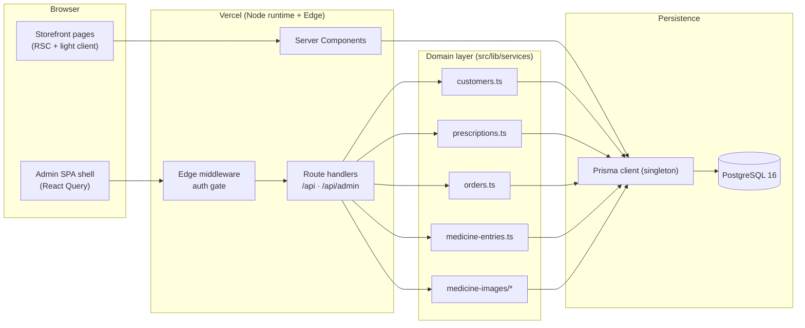
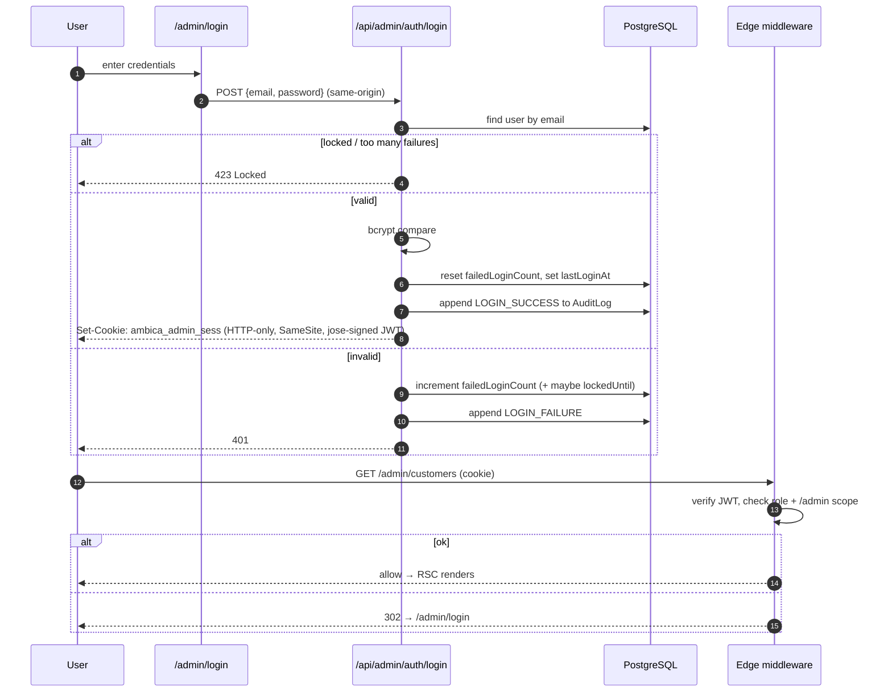
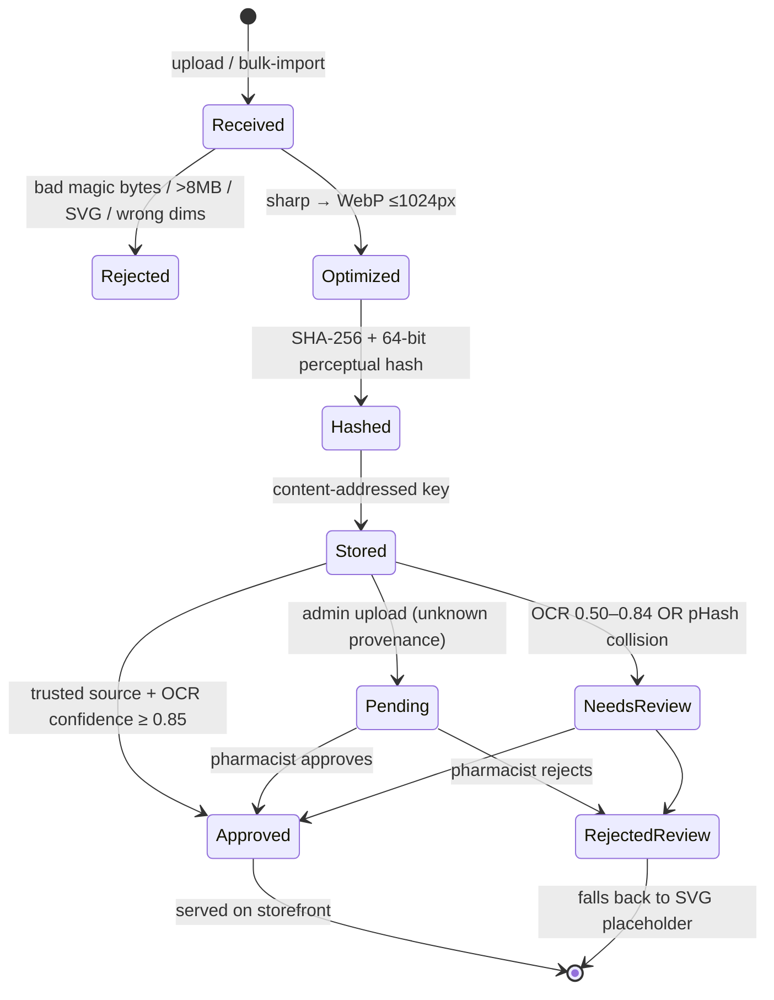
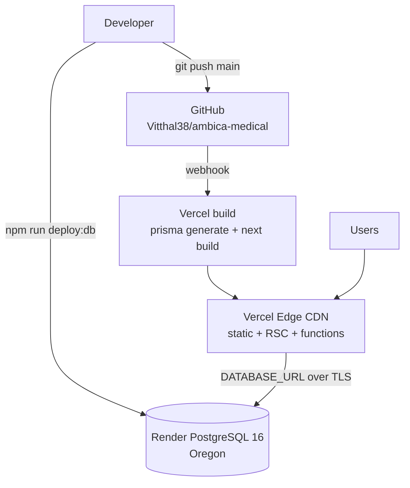

# Architecture

A deep tour of how Ambica Medical is put together — routing, layers, data flow,
auth, deployment, and the image pipeline. Diagrams are Mermaid (render natively
on GitHub).

> For scaling decisions and trade-offs, see [SYSTEM_DESIGN.md](./SYSTEM_DESIGN.md).
> For endpoints, see [API_REFERENCE.md](./API_REFERENCE.md).

---

## 1. Layered topology



**Principle:** route handlers are thin. They authenticate, validate (Zod), and
delegate to the service layer. Services own all Prisma access and transaction
boundaries. Nothing in `app/` talks to Prisma directly except via a service.

---

## 2. Routing (App Router)

```
src/app/
├── layout.tsx                  Root layout (Inter, Navbar, Footer, Providers)
├── page.tsx                    /  (landing)
│
├── products/                   /products · /products/[id]
├── category/[slug]/            /category/diabetes-care · …
├── cart/  checkout/            commerce flow
├── order/[id]/                 tracking + /print invoice
├── orders/                     order history
├── prescription/              4-step Rx upload wizard
├── faq/ contact/ return-policy/ privacy-policy/ terms-of-service/ image-credits/
│
├── (admin-auth)/admin/login/   public sign-in (own layout)
├── (admin)/admin/              authenticated CRM (sidebar layout)
│   ├── layout.tsx                  chrome + session re-check
│   ├── page.tsx                    dashboard
│   ├── customers/ …                list · new · [id] · [id]/edit · [id]/prescriptions/new
│   ├── orders/  prescriptions/  reminders/
│   └── medicine-images/            image studio
│
└── api/
    ├── (storefront)                placeholder rendering, etc.
    └── admin/                      auth-gated CRUD
```

**Route groups** `(admin)` vs `(admin-auth)` share the `/admin` prefix but use
different layouts — the dashboard chrome (sidebar + session re-check) is isolated
from the public login page.

---

## 3. Authentication flow



Two enforcement points by design: the **edge middleware** (cheap, blocks
unauthenticated traffic early) and the **handler-level `requireRole()`** (the
real boundary — never trusts the middleware alone).

---

## 4. Image pipeline (state machine)



When no real photo exists, a **deterministic SVG placeholder** is generated from
catalog fields (brand, generic, strength, dosage-form silhouette, Rx badge,
optional CC0 PubChem molecule watermark). Same inputs → byte-identical output →
cached `immutable`. Details in [IMAGES-ARCHITECTURE.md](./IMAGES-ARCHITECTURE.md).

---

## 5. Deployment topology



- **App** builds on Vercel; `prisma migrate deploy` is intentionally **not** in
  the build (ephemeral build runners + cold DB → flaky). Migrations run once from
  an operator machine via `npm run deploy:db`.
- **Database** is Render PostgreSQL with `sslmode=require`.
- See [DEPLOY.md](../DEPLOY.md) for the exact runbook and the rationale.

---

## 6. Key cross-cutting modules

| Module | Responsibility |
|---|---|
| `src/middleware.ts` | Edge auth gate for `/admin/*` and `/api/admin/*` |
| `src/lib/db.ts` | Prisma client singleton (avoids connection storms in dev) |
| `src/lib/auth.ts` | Session create/verify, cookie helpers (`jose`) |
| `src/lib/api-auth.ts` | `requireRole()` guard returning a typed auth result |
| `src/lib/audit.ts` | Append-only audit writer |
| `src/lib/security/file-validation.ts` | Magic-byte sniff + allow-list |
| `src/lib/medicine-images/` | pipeline · storage adapter · placeholder · confidence |
| `src/features/admin/schemas.ts` | Zod shapes shared by forms + handlers |

---

## 7. Design rules enforced across the codebase

1. **One schema, two consumers** — Zod schemas validate both the client form and the server handler.
2. **Services own transactions** — multi-row writes (e.g. customer + initial medicines) are atomic.
3. **PHI never on ephemeral disk** — prescription bytes live in Postgres `BYTEA`.
4. **Client MIME is never trusted** — uploads are identified by magic bytes.
5. **Audit before return** — PHI-access handlers append to `AuditLog` before responding.
6. **No secret in the repo** — all credentials via env; `.env.example` documents the shape only.
