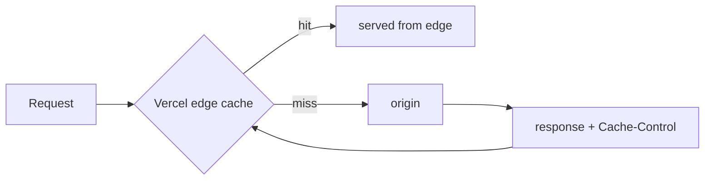

# Performance

How Ambica Medical stays fast, how to measure it, and what's next on the
optimization backlog. The target is **Lighthouse 90+** on the storefront with
real product imagery.

---

## 1. What's already optimized

| Technique | Where | Effect |
|---|---|---|
| **RSC-first rendering** | Storefront pages | Minimal client JS; HTML streams from the server |
| **Static catalog** | `src/data/*.json` bundled at build | Zero DB round-trips on the hottest path |
| **WebP everywhere** | Image pipeline (`sharp`, q82, ≤1024px) | ~30–35% smaller than equivalent JPEG |
| **Deterministic SVG placeholders** | `/api/placeholder/medicine` | Tiny, `Cache-Control: immutable` for 1 year |
| **Aspect-ratio-locked cards** | `ProductCard` (`aspect-square`) | Zero cumulative layout shift (CLS) |
| **Native lazy-loading** | `ProductImage` | Off-screen images deferred; `decoding="async"` |
| **Responsive `sizes`** | `ProductImage` | Browser fetches the right resolution per viewport |
| **Edge + CDN caching** | Vercel | Static assets + immutable image URLs served at the edge |
| **Content-addressed images** | pipeline storage keys | Re-uploads get a new URL → cache never stale, never needs purge |
| **`next/font` (Inter)** | root layout | Self-hosted, zero layout shift, no render-blocking font CSS |

---

## 2. Caching strategy



| Asset | `Cache-Control` | Rationale |
|---|---|---|
| SVG placeholders | `public, max-age=31536000, immutable` | Query string *is* the identity |
| Optimized pack-shots | `public, max-age=31536000` | Content-addressed key changes on re-upload |
| Static catalog chunk | hashed filename, immutable | Standard Next.js asset hashing |
| Admin API | `private, no-store` | Never cache PHI |

---

## 3. How to measure

```bash
# Production build locally
npm run build && npm start

# Lighthouse (Chrome DevTools → Lighthouse, or CLI)
npx lighthouse https://ambica-medical.vercel.app \
  --only-categories=performance,accessibility,best-practices,seo \
  --preset=desktop --view
```

Measure against the **live deployment** (edge cache warm), not `localhost`, for
representative numbers. Run mobile + desktop separately; the storefront is
mobile-first.

### What to watch (Core Web Vitals)

| Metric | Target | Lever if it regresses |
|---|---|---|
| **LCP** | < 2.5 s | Hero image priority; preconnect; image dimensions |
| **CLS** | < 0.1 | Keep aspect-ratio locks on every media slot |
| **INP** | < 200 ms | Trim client JS; defer non-critical hydration |
| **TTFB** | < 0.8 s | RSC + edge cache; avoid cold DB on the public path |

---

## 4. Optimization backlog

- [ ] Add `next/image` for first-party optimized images (currently plain `` for external + SVG URLs)
- [ ] Preload the LCP hero image with `fetchpriority="high"`
- [ ] Route-level code-splitting audit on the admin bundle (React Query views)
- [ ] `Cache-Control: s-maxage` + `stale-while-revalidate` on storefront RSC payloads
- [ ] Ship a Lighthouse CI check in the GitHub Actions workflow (budget gate)
- [ ] Image CDN transform (on-the-fly resize) once media moves to object storage
- [ ] Bundle-analyzer pass; set a per-route JS budget

---

## 5. Performance budget (proposed)

| Budget | Limit |
|---|---|
| Storefront route JS (gzipped) | ≤ 120 KB |
| Largest image on a card | ≤ 60 KB (WebP) |
| LCP (mobile, 4G) | ≤ 2.5 s |
| CLS | ≤ 0.05 |
| Lighthouse Performance | ≥ 90 |

These are aspirations encoded as a gate — wire them into CI (backlog item above)
so regressions fail the PR instead of shipping silently.
