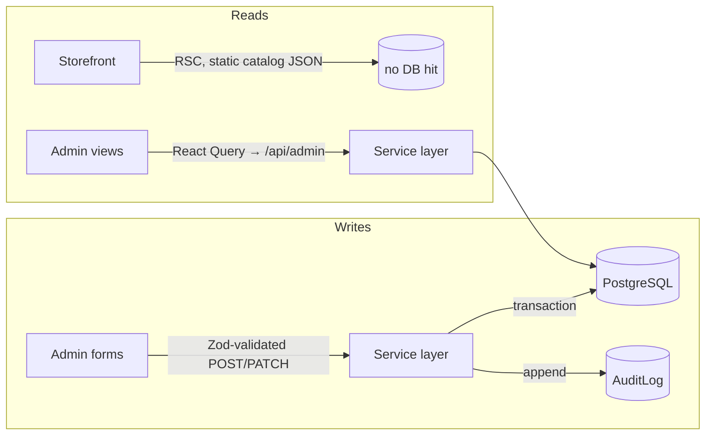

# System Design

How Ambica Medical is designed to stay correct, secure, and operable as it grows —
the trade-offs taken, the bottlenecks anticipated, and the migration paths kept open.

> Companion to [ARCHITECTURE.md](./ARCHITECTURE.md) (how it's built today).

---

## 1. Design goals, in priority order

1. **Patient-data safety** — PHI is handled like it matters: access-controlled, audited, residency-aware.
2. **Correctness over cleverness** — atomic writes, typed boundaries, no half-saved states.
3. **Operability** — a single pharmacist can run it; deploys are boring and reversible.
4. **Lean surface area** — fewer dependencies = fewer CVEs, smaller bundle, easier audit.
5. **Scalable when needed, not before** — clear upgrade paths instead of premature distribution.

---

## 2. Data-flow model

The **storefront catalog is static JSON** (516 SKUs) bundled at build time — zero
DB load for the highest-traffic path. The database serves the admin/dispensary
side and order writes. This split keeps the public site fast and cheap while the
operational core stays transactional.

---

## 3. Consistency & transactions

- **Customer + initial medicines** are inserted in one `prisma.$transaction` — a
  customer never exists without their first dispense record when one was supplied.
- **Image replace** updates the row and removes the prior blob *after* the new
  upload succeeds — a storage hiccup never costs the existing image.
- **Audit writes** are best-effort-after-commit for reads, and pre-response for
  PHI access — the log is the source of truth for "who saw what."

---

## 4. Scalability analysis

| Dimension | Today | First bottleneck | Mitigation (kept open) |
|---|---|---|---|
| **Storefront traffic** | Static catalog + edge CDN | None until SSR-personalization | Already CDN-cached; add ISR if catalog goes dynamic |
| **Admin concurrency** | Single pharmacy, low QPS | Prisma connection count on serverless | Prisma Data Proxy / PgBouncer pooling |
| **Prescription storage** | Postgres `BYTEA`, ≤5 MB each | DB size / backup time at ~5 GB | Migrate bytes → R2/Vercel Blob; `storageKey` discriminator makes it row-by-row |
| **Image catalog** | Files in `public/` + CDN | Repo size as SKUs grow | Move to object storage; pipeline already abstracts the backend |
| **Audit log growth** | Single table, indexed on `ts` | Query latency at tens of millions of rows | Time-partition by month; cold-archive to object storage |
| **Search** | In-memory over static catalog | Catalog > ~5k SKUs | Postgres `tsvector` GIN, or a dedicated search index |
| **Multi-branch** | Single tenant | Cross-branch data isolation | Tenant-prefix keys + row-level tenant column + RLS |

**Philosophy:** every bottleneck above has a known, incremental fix. None require
a rewrite. We don't pay the complexity tax until the traffic justifies it.

---

## 5. Failure modes & resilience

| Failure | Behaviour | Recovery |
|---|---|---|
| DB unreachable | Admin writes 5xx with a request id; storefront unaffected (static) | Render auto-restart; retry |
| Image upload mid-flight crash | No partial row — DB write is the last step | Re-upload; content-addressed key dedups |
| Cold DB on serverless | First request slow (~connection warm-up) | Connection reuse via Prisma singleton |
| Bad migration | Caught locally before `deploy:db`; never auto-run in CI build | Roll forward with a corrective migration |
| Lost session | Middleware 302 → login | Re-auth; no data exposure |

---

## 6. Security architecture (summary)

Full detail in [SECURITY.md](../SECURITY.md). The design stance:

- **Two auth checkpoints** (edge + handler) so a middleware regression can't expose data.
- **Least privilege** — role-gated; scope-guarded; PHI access audited.
- **Untrusted input is hostile** — Zod at every boundary, magic-byte file checks, strict CSP.
- **Secrets never in git** — env-only; entropy-checked `AUTH_SECRET`.

---

## 7. Observability

- **Audit log** — the domain-level "who did what to which patient record, from where, when."
- **Request ids** — surfaced in error envelopes (`safeError`) so a user-reported "Server error.
  Reference this request id" maps to a server log line.
- **Structured info logs** — e.g. the file-validation soft-warning when a browser lies about MIME.

Future: wire to a log drain (Vercel → Datadog/Axiom) and add uptime + Core Web Vitals monitoring.

---

## 8. Trade-offs we made on purpose

| Decision | Alternative | Why we chose this |
|---|---|---|
| Static catalog JSON | DB-backed catalog | Storefront speed + cost; catalog changes are infrequent |
| PHI in Postgres BYTEA | S3/Blob from day one | Zero extra vendor for PHI; data residency; atomic writes; clean migration path later |
| `jose` JWT cookies | NextAuth | Smaller surface, full control, no adapter lock-in |
| No component library | Radix/shadcn | Lean bundle, auditable primitives |
| Migrations run by operator | Migrate-on-build | Build runners + cold DB make build-time migration flaky |
| Custom image pipeline | Cloudinary/imgix | No per-image cost, no third-party PHI-adjacent processing, full control |
